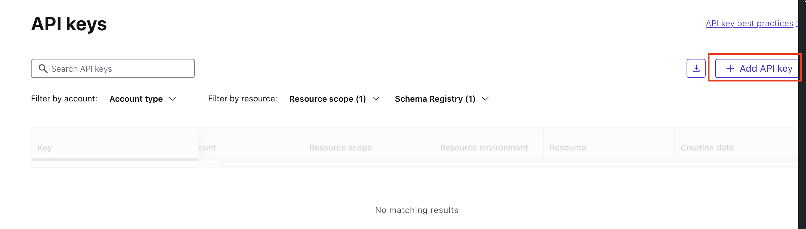
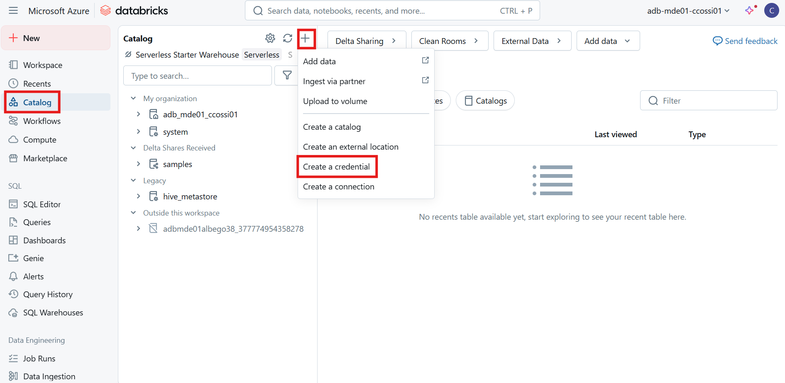

# Data Pipeline Implementation for Farmia.

# Project Description

This project is designed to ingest, process, and refine data from diverse sources using a multi-engine architecture. The data undergoes a structured transformation pipeline based on the medallion architecture, progressing through Bronze, Silver, and Gold layers.

# Context

Farmia operates multiple systems that continuously generate data from various sources in different formats, all of which must be efficiently ingested for further processing.

## Datasets

### Client Real Time Data: 

The company maintains a Kafka topic to which a system continuously publish data about the activity of clients in the webpage and social media platforms. The structure of the events is as follows:

- **`timestamp`**: The ISO-formatted date and time when the user activity was recorded.
- **`full_name`**: The user's full name.
- **`email`**: The user's email address.
- **`age`**: The user's age.
- **`clicked_ads`**: The number of ads the user has clicked on.
- **`wishlist_items`**: A list of product IDs the user has added to their wishlist.
- **`engagement_score`**: A float between 0 and 1 representing the user's level of engagement (based on activity and interactions).

## Climate Data (JSON Format):

Given the nature of the company’s agricultural operations, weather conditions significantly impact both the production and quality of its products. To account for this, the company has established a contract with a meteorological center to receive hourly weather data from strategically selected locations across the country. The structure of the dataset is as follows:

- **`timestamp`**: The date and time when the weather observation was recorded.
- **`station_id`**: A unique identifier for the weather station collecting the data.
- **`coord`**: The geographical coordinates (latitude and longitude) of the weather station.
- **`temperature_C`**: The ambient temperature in degrees Celsius.
- **`precipitation_mm`**: The amount of precipitation recorded, measured in millimeters.
- **`humidity_percent`**: The relative humidity, expressed as a percentage.
- **`solar_radiation_Wm2`**: The intensity of solar radiation at the station, measured in watts per square meter.
- **`wind_speed_mps`**: The wind speed at the time of observation, measured in meters per second.

## Product's Images.
To analyze product quality and develop image processing models for detecting and discarding defective items, a dataset of images is delivered to the landing zone every 5 minutes.

## Inventory Data (CSV Format):
The internal inventory system is continuously updated to reflect product sales and purchases made by the company. The corresponding dataset includes the following fields:

- **`timestamp`**: The date and time when the inventory record was modified (a sale or a purchase).
- **`store_id`**: A unique identifier for the store where the product is tracked.
- **`category`**: The product category or classification (e.g., pesticide, fertilizer, etc).
- **`stock_quantity`**: The number of units of the product in stock.
- **`purchase_price`**: The cost at which the store purchased the product from the vendor.
- **`vendor_id`**: A unique identifier for the supplier or vendor of the product.
- **`product`**: The name or description of the product.
- **`sales_price`**: The price at which the product is sold to customers.
- **`manufacturing_date`**: The date when the product was manufactured or produced.
- **`expiration_date`**: The date after which the product is considered no longer suitable for sale or consumption.

## IoT Sensors:
The company uses real-time sensors to monitor conditions across the entire farm. These sensors continuously generate data and publish their measurements to a Kafka topic in real time. This is the structure of the events generated:

- **`timestamp`**: The date and time when the sensor measurement was recorded.
- **`soil_temperature`**: The temperature of the soil at the time of recording, in degrees Celsius.
- **`soil_humidity`**: The moisture level present in the soil.
- **`soil_quality`**: An overall indicator or score representing the health or fertility of the soil, based on predefined criteria.

## Logistics Data (Parquet Format):
To maintain a record of client deliveries, a system continuously updates the status of multiple transactions several times a day. The structure of the resulting dataset is as follows:

- **`timestamp`**: The date and time when the status update was recorded.
- **`order_id`**: A unique identifier for the customer’s order.
- **`coord`**: The geographical coordinates (latitude and longitude) associated with the delivery location (no in real time).
- **`pickup_date`**: The date when the order was picked up for delivery.
- **`scheduled_delivery_date`**: The initially planned date for the order to be delivered.
- **`shipment_status`**: The current status of the shipment (e.g., "sent", "pending", "received").
- **`actual_delivery_date`**: The date when the order was actually delivered to the client.

## Online Sales Data (CSV Format):
This dataset contains all orders placed by clients through the company's website.

- **`order_id`**: A unique identifier for the customer’s order.
- **`transaction_id`**: A unique identifier for the payment transaction associated with the order.
- **`user_id`**: A unique identifier for the user who made the purchase.
- **`sales_price`**: The total amount paid for the order.
- **`currency`**: The currency used in the transaction (e.g., USD, EUR).
- **`payment_method`**: The method of payment used (e.g., credit card, PayPal).
- **`transaction_status`**: The current status of the transaction (e.g., "completed", "pending", "failed").
- **`coord`**: The geographical coordinates (latitude and longitude) of the billing location.
- **`city`**: The city where the order was placed.
- **`address`**: The full street address associated with the order.
- **`category`**: The product category or type.
- **`product`**: The name or description of the purchased product.

# Designed Architecture.

As illustrated, the data originates from multiple sources, arrives in various formats and requires ingestion from both batch and streaming workloads. Based on discussions with the client, it was determined that a unified ingestion and processing workflow would be implemented for both types of workloads. This decision was driven by two factors: the client does not require real-time processing, and the volume of streaming transactions is relatively low. Running continuous ingestion in this context would lead to the generation of a large number of small files, which is inefficient for downstream processing. The following image presents the proposed architecture.


For the processing tasks in each layer, a dedicated library was developed. The source code is located in the `src` folder of this repository.

## Landing Zone:
A contract was established with each data producer to deliver their data to a designated landing container within our storage account using a push strategy. This approach prevents overloading the producers and allows data to be processed in alignment with production, eliminating the need for active polling or data retrieval by our system.

## Bronze Layer:
An Ingestion Engine was designed and developed to handle this step. It operates based on a JSON configuration file, which defines a set of parameters that control its behavior. The process begins by reading data from the appropriate container in the landing zone. During ingestion, metadata such as ingestion timestamp and source file path is added. The raw data is then loaded into the Bronze layer in Delta format. An external table is registered in the data catalog to enable easy access and discovery.

Leveraging Databricks Autoloader, the engine automatically tracks previously ingested data, ensuring idempotency and preventing reprocessing. The engine supports both batch and streaming workloads and is capable of reading from either a storage account or a Kafka topic.

### Configuration Template.

```json
{
    "storage_account_name": "<replace>",
    "lakehouse_container_name": "<replace>",
    "secret_scope": "<replace>",
    "secret_key_name": "<replace>",
    "datasource": "<replace>",
    "dataset": "<replace>",    
    "source": {
        "format" : "<replace>",
        "options" : {          
            "<opt1>": "<replace>",
            ...
        }
    },
    "sink": {        
        "format": "delta",
        "options": {
            "mergeSchema": "true"
        }
    }
}
```

## Silver Layer:
In the Silver layer, a series of imputations and transformations are performed to clean and standardize the data. A dedicated Processing Engine was developed, following the same architectural principles as the one used in the Bronze layer. Each dataset is accompanied by a configuration file that defines the specific processing logic, including imputation rules and transformation steps. These configurations were defined in close collaboration with the client, tailored to the characteristics and requirements of each dataset.

The data is read directly from the data catalog, processed accordingly, and written to an external Delta table within the Silver schema. For consistency, any null values in the timestamp column are replaced with the current processing timestamp, which is a reasonable approximation, as the data is generally generated on the same day but at varying hours. Additionally, the data is partitioned by `year`, `month`, and `day` to enable efficient filtering and take advantage of predicate pushdown in downstream use cases.

Each configuration file includes a `last_ingest_processed_date` field, which serves as a checkpoint for the processing layer. This mechanism simplifies reprocessing by allowing users to specify from which ingestion point the data should be reprocessed simply by editing this parameter. If the value is set to `null`, the process will include all available data; otherwise, it will only process records with an `_ingestion_time` greater than to the specified date. Upon successful completion of the process, this parameter is automatically updated with the maximum `_ingestion_time` value found in the current batch, ensuring accurate tracking for subsequent runs.

The following section outlines the specific processing rules that have been defined.

### Configuration Template.

```json
{
    "storage_account_name": "<replace>",
    "lakehouse_container_name": "<replace>",
    "secret_scope": "<replace>",
    "secret_key_name": "<replace>",
    "datasource": "<replace>",
    "dataset": "<replace>",
    "last_ingest_processed_date": null,
    "timestamp_col": "<replace>",
    "source": {
        "schema": "bronze",
        "table": "<replace>"
    },
    "sink": {
        "schema": "silver",
        "table": "<replace>"
    },
    "transformations": {
        "<col>": "<replace>"
    },
    "imputations": [
        {
            "field": "<replace>",
            "method": "<replace>",
            ...
        },
        ...
    ]
}
```

### Climate Dataset.
#### Climate Dataset Transformations:
- Timestamp values are casted to a readable format.

#### Climate Dataset Imputations
- For each variable (`temperature_C`, `humidity_percent`, `precipitation_mm`, `solar_radiation_Wm2`, `wind_speed_mps`), a moving average is calculated using a 3-hour window. In cases where values are missing (`null`), they are imputed using the mean of the available data within the same 3-hour window.

### Inventory Dataset

#### Inventory Dataset Transformations:
- `category` variable to upper case.
- The `product` field arrives in inconsistent formats, typically combining both the `product_id` and `product_name` in a single string with varying cases and special characters. To address this, a regular expression is applied to extract the `product_id` and `product_name` separately. Both values are then standardized by converting them to uppercase.

#### Inventory Dataset Imputations:
- `Null` values in the `stock_quantity` field are imputed using the mean `stock_quantity` calculated for the corresponding `product_id` within the current processing batch, ensuring product-level consistency in the imputation process.
- `Null` values in the `expiration_date` field are imputed by adding 40 days to the `manufacturing_date`, based on the average shelf life of the company's products as provided by the client.
- `Null` values in the `sales_price` field are imputed using the average sales price of products with the same `product_id` within the current processing batch.

### IoT Sensors Dataset

#### IoT Sensors Dataset Imputations:
- For each variable (`soil_temperature`, `soil_humidity`, `soil_quality`), a moving average is calculated using a 2-hour window. In cases where values are missing (`null`), they are imputed using the mean of the available data within the same 2-hour window.

### Logistics Dataset

#### Logistics Dataset Transformations:
- The `coord` field is originally provided as an array in the format `[{latitude}, {longitude}]`. Latitude and longitude values are extracted and assigned to separate columns (`latitude`, `longitude`) for proper geospatial handling.
- The `shipment_status` field is standardized by converting all values to uppercase.

#### Logistics Dataset Imputations:
- If the `actual_delivery_date` field is `null` and the `shipment_status` is `RECEIVED`, the value is imputed with the `scheduled_delivery_date`. This rule is based on the insight that approximately 80% of deliveries occur on the scheduled date.

### Online Sales Dataset

#### Online Sales Dataset Transformations:
- `payment_method`, `transaction_status`, `city` and `category` fields are standarized by converting all the values to uppercase.
- The `coord` field is originally provided as a string in the format `"({latitude}, {longitude})"`. Latitude and longitude values are extracted using regular expressions, assigned to separate columns (`latitude`, `longitude`), and cast to the `double` data type for proper geospatial handling.
- In some cases, the `address` field includes a postal code embedded within the text. Using regular expressions, the postal code is extracted and stored in a new column called `postal_code`. The `address` field is also standardized by converting all values to uppercase.
- The `product` field arrives in inconsistent formats, typically combining both the `product_id` and `product_name` in a single string with varying cases and special characters. To address this, a regular expression is applied to extract the `product_id` and `product_name` separately. Both values are then standardized by converting them to uppercase.

#### Online Sales Dataset Imputations:
- `Null` values in the currency field are imputed with `EUR`, as it is the default transaction currency used by the company.
- `Null` values in the payment_method field are replaced with `credit_card`, the most commonly used payment method among customers.

## Gold Layer

A set of predefined aggregations has been implemented to support business intelligence dashboards and analytical needs. As with previous components, these aggregations are driven by configuration files that define the necessary parameters for execution. The primary objectives of these aggregations are to: (1) analyze the impact of weather conditions on sales, given their strong correlation; (2) evaluate order fulfillment performance to identify and address potential issues in meeting customer expectations in logistics; and (3) assess sales volume trends to inform strategic decision-making. The architecture remains flexible, allowing for the addition of further aggregations as business needs evolve.

### Configuration Template

```json
{
    "storage_account_name": "<replace>",
    "lakehouse_container_name": "<replace>",
    "secret_scope": "<replace>",
    "secret_key_name": "<replace>",
    "dataset": "<replace>",
    "sink": {
        "schema": "gold",
        "table": "<replace>"
    }
}
```

# How to run the project?

## Azure Environment Setup

This section outlines the steps to set up the necessary resources for successfully running the project.

### Create a resource group
Create a resource group and consider naming it `rg-databricks`. This will help organize all resources logically within the resource group. From this point on, each resource should be created within the resource group.


### Create a Storage Account.

1. Create a Storage Account within the resource group.
2. Name the Storage Account (suggested format: `dlsmde01{your_user_name}`).
3. Choose the North Europe region for cost-effectiveness.
4. Select Standard performance.
5. To further reduce costs, opt for LRS (Locally Redundant Storage) redundancy.
6. Click 'Next' to proceed.


7. In this window, it is crucial to select the **Enable hierarchical namespace** checkbox.


8. Leave the remaining configurations at their default settings and proceed to create the resource.

### Create Azure Databricks Workspace
1. Within the resource group, use the marketplace to search for the Azure Databricks service and proceed to create it.


2. Provide a name for the resource group (suggested format: `adb-mde01-{your_user_name}`).
3. Choose the North Europe region.
4. Select "Trial" for the pricing tier.
5. For the managed resource group name, enter `rg-managed-databricks` to make it easier to identify.


6. Click 'Next' and select 'No' in the subsequent window.


7. Click review and create.

### Create the Containers

The project is designed to include two containers within the storage account: one for Landing and the other for the Lakehouse.

1. Navigate to the created Storage Account. On the left-hand side, select **Data Storage** > **Containers** > **+ Container**, as illustrated in the image. Create two containers with the suggested names: **`landing`** and **`lakehouse`**.


2. Inside the **lakehouse** container, create three folders: **`bronze`**, **`silver`**, and **`gold`**.


3. Next, navigate to the **Security + networking** tab in the storage account. Then, select **Access keys** and copy the value of the key to use in the upcoming steps.


### Create the Key Vault

Again, within the resource group, use the marketplace to create the Key Vault service.

1. Assign a name to the Key Vault (suggested format: `akvmde01{your_user_name}`).
2. Select the North Europe region.
3. Choose the Standard tier.


4. Leave the remaining options at their default settings and click **Review + create**.  
5. Access the created resource, navigate to the **Access Control (IAM)** tab, click the **Add** button, and then select **Add role assignment**.


6. Select the **Key Vault Secrets Officer** role.


7. Click **Select members** and search for your own user account as well as the **Azure Databricks Application**.


8. Click **Review + assign** to finalize the role assignment.  
9. Create a new secret by assigning a name (suggested: `stg-account-access-key`) and pasting the key obtained from the storage account.


### Create a Databricks Access Connector

1. Within the resource group, use the marketplace to create a **Databricks Access Connector**.


2. Assign a name to the Databricks Access Connector (suggested format: `dac-mde01-{your_user_name}`) and select the North Europe region.


3. Navigate to the storage account, click on the **Access Control (IAM)** tab, and assign the **Storage Blob Data Contributor** role to the Databricks Access Connector.


4. Select the created resource (ensure you select the one with the correct name: `dac-mde01-{your_user_name}`).


5. Review and assign.

The resource group should include the following resources:


## Confluent Kafka Setup

1. Create a basic cluster.
2. Within the cluster, create a client.


3. Select **Python** and **Create a new API key**, leave the configurations as default settings and download the file.


4. Create the default topic it suggests.

5. Download the Quick Start template, which will come as a ZIP file. After unzipping it, locate the `client.properties` file, which is the file we'll be working with. Copy it into the `.config/confluent_kafka/` directory on your local system, and rename it to `client_properties`. This naming aligns with how Databricks File System (DBFS) will store the file once uploaded, ensuring consistency between the local and cloud environments.

6. Go to the Schema Registry tab.


7. Generate a new API key


8. Select the following options and put the name you want.


9. The interface will display your API key and secret. Open the `./config/confluent_kafka/client_properties` file and add the following line (you may also download the file to securely store the keys):

```
basic.auth.user.info={API_key}:{API_secret}
```

10. In the Schema registry tab copy the public endpoint URL and add the following line to the `config_properties` file:

```
url={URL}
```

## Databricks Configurations

### Create External Locations for each Layer

1. Navigate to the created Databricks Access Connector and retrieve the resource ID.


2.Launch the Databricks workspace, navigate to the **Catalog** tab, and create a credential.



3. Enter the name of your Databricks Access Connector and paste the copied resource ID.


4. Navigate to the Storage Account, click on the **Settings** tab, then select **Endpoints**. Scroll down to find the **Data Lake Storage** section and copy the value starting with `//`, excluding the slashes.


5. Then, create an external location.


6. Assign a name to the external location and enter the following format in the URL field: `abfss://{lakehouse_container_name}@{copied_value}/{layer}`. If the suggested names have been used, it should resemble this for the silver layer: `abfss://lakehouse@dlsmde01{your_user_name}.dfs.core.windows.net/silver`. In the **Storage Credential** dropdown, select the credential you created previously.


7. Test the connection.


**Repeat the process for the remaining layers (bronze and gold)**. When completed, the external locations should appear as follows:


### Create a Secret Scope
1. Navigate to the **Secrets Vault**, then click on **Settings** > **Properties** and copy both the **Vault URI** and **Resource ID**.


2. In the Databricks workspace, append `#secrets/createScope` to the URL after `.net`. The URL should end up looking like `azuredatabricks.net/#secrets/createScope`. Hit **Enter**, and a different interface will appear. In the **Scope Name** field, enter the name of the key vault you created (`akvmde01{your_user_name}`). In the **DNS Name** field, paste the copied Vault URI, and in the **Resource ID** field, paste the Resource ID.


### Create a Compute

1. Navigate to the Compute tab.
2. Select create a compute.
3. In the policy section, select **Personal Compute**. Then, choose the **runtime** as **15.4 LTS** and set the **node type** to **Standard_DS3_v2**.


### Activate DBFS

1. Navigate to settings.


2. Turn on the DBFS.


## Library Installation

Run the following command:

```shell
python -m build
```

This process will generate a dist folder containing the .whl (wheel) file. To install it in Databricks, navigate to the Compute tab, select your cluster, then go to the Libraries tab and click the `Install New` icon.


Then click browse and upload the .whl file.


## Config Files Setup

You just need to edit 2 parameters in ALL the json config files, if you have been following the suggested names, if not edit 4. Replace as follows:

```json
{
    "storage_account_name": "dlsmde01{your_user}",
    "secret_scope": "akvmde01{your_user}",
    "lakehouse_container_name": "<name_you_choose>", // If the naming strategy has not been followed
    "secret_key_name": "<name_you_choose>", //If the naming strategy has not been followed
}
```

Upload the configuration files to DBFS by replicating the local folder structure within the FileStore directory.


## Load Databricks Notebooks

Upload the notebooks located in the `databricks_notebooks` folder to your Databricks workspace. Since the notebooks are parameterized, you only need to replace the required parameters before execution.

## Data Generation

### Real-Time Data generation
1. Create a Virtual Environment and install the `whole_requirements.txt`.

2. Open the `./data_generation/streaming_data_generation.ipynb` notebook and run the first two cells. The second cell should output the schema registry config, if not, complete the configuration. Next, run the third cell, which is responsible for creating the required Kafka topics. Once completed, your notebook should resemble the following state:


3. Now you can generate the amount of messages you want in each topic by running the corresponding cell.

### Batch Data Generation

1. Open the `./data_generation/batch_data_generation.ipynb` notebook and run all cells up to the Data Generation section. After that, execute the cells corresponding to the dataset(s) you wish to generate. You can produce as many files as needed. The generated files should then be manually uploaded to the appropriate folder in the landing zone, following the directory structure defined below:

- **Climate data**: `landing/meteorologic_center/climate/`
- **Inventory**: `landing/internal_system/inventory/`
- **Logistics**: `landing/internal_system/logistics/`
- **Online Sales**: `landing/webpage/online_sales/`
- **Images**: `landing/internal_system/products_images/` (The generation and maintenance of this dataset fall under the user's responsibility.)

It is recommended to delete the contents of the corresponding local folder using the Clean Folder Contents section each time the dataset is uploaded to the landing zone. This helps prevent reloading previously processed data.

## Processing Workflow

The goal is to orchestrate the workflow for each dataset using Databricks Workflows, based on the specific processing requirements of each case. Ultimately, each engine requires only the dataset name (and the workflow name for the Bronze layer), which is straightforward thanks to the use of parameterized notebooks. This orchestration setup is planned but still pending implementation.

### Valid Parameters Per Engine.

- Bronze:
    - Dataset: `climate`, Workload: `batch`
    - Dataset: `images`, Workload: `batch`
    - Dataset: `inventory`, Workload: `batch`
    - Dataset: `logistics`, Workload: `batch`
    - Dataset: `online_sales`, Workload: `batch`
    - Dataset: `client_real_time`, Workload: `streaming`
    - Dataset: `iot_sensors`, Workload: `streaming`

- Silver:
    - Dataset: `climate`
    - Dataset: `inventory`
    - Dataset: `iot_sensors`
    - Dataset: `logistics`
    - Dataset: `online_sales`

- Gold:
    - Aggregation: `climate_impact`
    - Aggregation: `order_fulfillment_performance`
    - Aggregation: `sales_volume`

At the end of the execution of the workflow for each dataset, the catalog should like as shown in this image:

